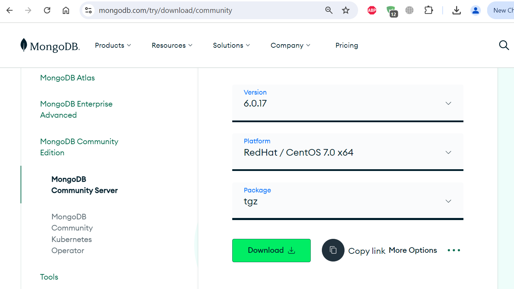
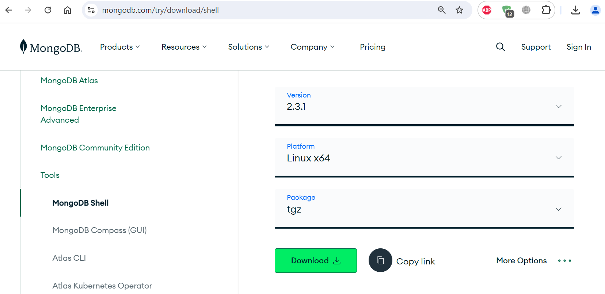

## MongoDB Binary Install: 
- `mongod` stands for Mongo Daemon.
- `mongosh` is a command line shell that can interact with the client


### Prerequisites: 

```
yum install libcurl openssl xz-libs -y

yum install libcrypto.so* -y
```


```
apt install libssl1.0.0 libssl-dev
```


### Download the tarball: 

Use the following link `https://www.mongodb.com/try/download/community` download the MongoDB Community .tgz tarball:

- In the `Version` dropdown, select the version of MongoDB to download.
- In the `Platform` dropdown, select your operating system version and architecture.
- In the `Package` dropdown, select `tgz`.
- Click `Download`.





```
mkdir -p /mongodb/6.0.17
```


```
cd /mongodb/6.0.17

wget https://fastdl.mongodb.org/linux/mongodb-linux-x86_64-rhel70-6.0.17.tgz

tar -xzvf mongodb-linux-x86_64-rhel70-6.0.17
```


```
mv mongodb-linux-x86_64-rhel70-6.0.17 mongodb-6.0.17
```


```
ll mongodb-6.0.17/

drwxr-xr-x 2 root root   57 Sep 10 04:32 bin
-rw-r--r-- 1 root root  30K Aug 14 04:48 LICENSE-Community.txt
-rw-r--r-- 1 root root  17K Aug 14 04:48 MPL-2
-rw-r--r-- 1 root root 2.1K Aug 14 04:48 README
-rw-r--r-- 1 root root  78K Aug 14 04:48 THIRD-PARTY-NOTICES
```


```
vim mongodb-6017.sh

export MONGO_HOME=/mongodb/6.0.17/mongodb-6.0.17
export PATH=$MONGO_HOME/bin:$PATH
```


```
cp mongodb-6017.sh /etc/profile.d/
source /etc/profile.d/mongodb-6017.sh
```


```
mongod --version

db version v6.0.17
Build Info: {
    "version": "6.0.17",
    "gitVersion": "1b0ca02043c6d35d5cfdc91e21fc00a05d901539",
    "openSSLVersion": "OpenSSL 1.0.1e-fips 11 Feb 2013",
    "modules": [],
    "allocator": "tcmalloc",
    "environment": {
        "distmod": "rhel70",
        "distarch": "x86_64",
        "target_arch": "x86_64"
    }
}
```


### Configure MongoDB:

```
mkdir /mongodb/6.0.17/data
mkdir /mongodb/6.0.17/log
```


_Create the Config file: [If no present create file]_


```
vim /mongodb/6.0.17/mongodb-6.0.17/mongod.conf


### mongod.conf

# for documentation of all options, see:
#   http://docs.mongodb.org/manual/reference/configuration-options/

# where to write logging data.
systemLog:
  destination: file
  logAppend: true
  #path: /var/log/mongodb/mongod.log
  path: /mongodb/6.0.17/log/mongod.log

# Where and how to store data.
storage:
  #dbPath: /var/lib/mongo
  dbPath: /mongodb/6.0.17/data

# how the process runs
processManagement:
  timeZoneInfo: /usr/share/zoneinfo

# network interfaces
net:
  port: 27017
  bindIp: 0.0.0.0  # Enter 0.0.0.0,:: to bind to all IPv4 and IPv6 addresses or, alternatively, use the net.bindIpAll setting.


#security:
#operationProfiling:
#replication:
#sharding:

## Enterprise-Only Options
#auditLog:

```


### Start MongoDB:


```
mongod -h
```


```
mongod --dbpath /mongodb/6.0.17/data

or,

mongod --dbpath /mongodb/6.0.17/data --logpath /mongodb/6.0.17/log/mongod.log

or,


### Worked: 

mongod --dbpath /mongodb/6.0.17/data --logpath /mongodb/6.0.17/log/mongod.log --bind_ip 0.0.0.0
```


_Used this: [Worked]_


```
screen -S mongodb
```


```
mongod --config /mongodb/6.0.17/mongodb-6.0.17/mongod.conf
```


_Start using Shell:_
```
vim mongod-start.sh 

mongod --config /mongodb/6.0.17/mongodb-6.0.17/mongod.conf
```


```
chmod +x mongod-start.sh

./mongod-start.sh
```


```
tail -f /mongodb/6.0.17/log/mongod.log
```


```
netstat -tulpn | grep 27017

ps aux | grep mongod
```


### Stop MongoDB:

```
kill -9 $(pgrep mongod)
```


```
vim mongod-stop.sh 

kill -9 $(pgrep mongod)
```


```
chmod +x mongod-stop.sh

./mongod-stop.sh
```


### Links:
- [Install MongoDB Community Edition](https://www.mongodb.com/docs/v6.0/tutorial/install-mongodb-on-red-hat/)
- [Install MongoDB Community using .tgz Tarball](https://www.mongodb.com/docs/v6.0/tutorial/install-mongodb-on-red-hat-tarball/)
- [MongoDB Community Server .tgz Download ](https://www.mongodb.com/try/download/community)
- [MongoDB Community Downloads](https://www.mongodb.com/try/download/community-edition/releases)


---
---


## MongoDB-Shell:

MongoDB Shell is the quickest way to connect to (and work with) MongoDB. Easily query data, configure settings, and execute other actions with this modern, extensible command-line interface — replete with syntax highlighting, intelligent autocomplete, contextual help, and error messages.





```
mkdir -p /mongodb/6.0.17/mongo-shell
```


The extracted archive has a bin folder that contains two files, `mongosh` and `mongosh_crypt_v1.so`.
```
cd /mongodb/6.0.17/mongo-shell

wget https://github.com/mongodb-js/mongosh/releases/download/v2.0.2/mongosh-2.0.2-linux-x64.tgz

or,

wget https://downloads.mongodb.com/compass/mongosh-2.3.1-linux-x64.tgz
```


```
tar -xzvf mongosh-2.0.2-linux-x64.tgz
```


```
ll mongosh-2.0.2-linux-x64/bin/

-rwxr-xr-x 1 root root 107M Oct 14  2023 mongosh
-rwxr-xr-x 1 root root 103M Oct 14  2023 mongosh_crypt_v1.so
```


```
cd mongosh-2.0.2-linux-x64/bin
chmod +x mongosh
```


```
cp mongosh /usr/local/bin
cp mongosh_crypt_v1.so /usr/local/lib
```


```
mongosh --version

2.0.2
```


```
mongosh -h

--host [arg]                           Server to connect to
--port [arg]                           Port to connect to

-u, --username [arg]                       Username for authentication
-p, --password [arg]                       Password for authentication
    --authenticationDatabase [arg]         User source (defaults to dbname)
		
--version                              Show version information
```


```
mongosh

Current Mongosh Log ID: 66df95906fd845770f07a093
Connecting to:          mongodb://127.0.0.1:27017/?directConnection=true&serverSelectionTimeoutMS=2000&appName=mongosh+2.0.2
Using MongoDB:          6.0.17
Using Mongosh:          2.0.2
```


```
mongosh --port 27017
mongosh --host 192.168.10.190 --port 27017
```


```
mongosh -u Admin -p --authenticationDatabase admin
```


_Work press tab twice for command help:_
```
test> help
```


_Show all databases:_
```
test> show dbs

admin   40.00 KiB
config  12.00 KiB
local   40.00 KiB
```


_Show current DB:_
```
test> db
	test
```


_Switch to a different:_
```
test> use mydb
test> exit
```


### For Copy-Paste: [Worked: centos-7 & rocky-8]

```
yum install libcurl openssl xz-libs -y
yum install libcrypto.so* -y
```


```
apt install libssl1.0.0 libssl-dev
```


```
unzip mongodb.zip
```


### Links: 
- [MongoDB Shell Download](https://www.mongodb.com/try/download/shell)
- [Install mongosh](https://www.mongodb.com/docs/mongodb-shell/install/)
- [Github:mongodb-js/mongosh](https://github.com/mongodb-js/mongosh/releases)


